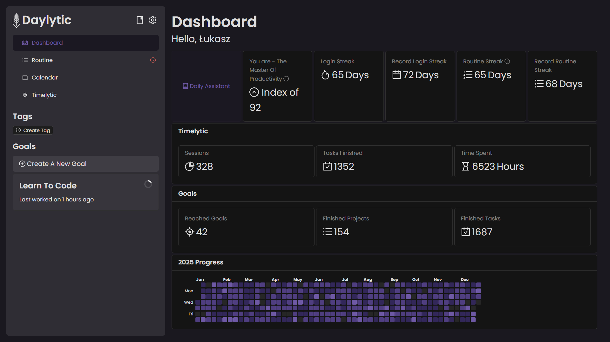
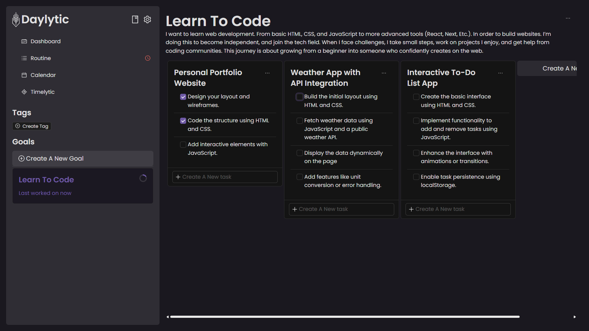
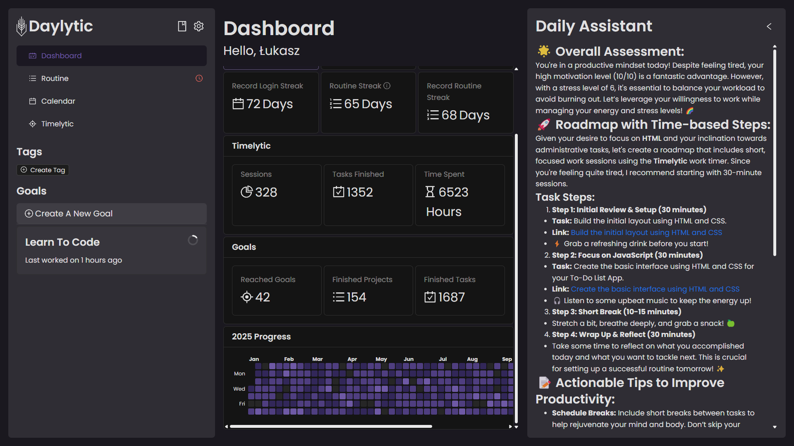
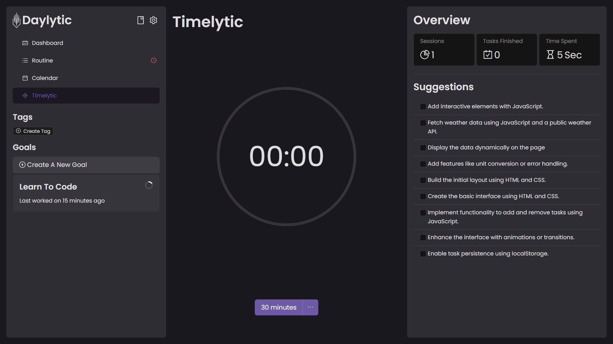

# Daylytic - Reach Your Goals, With a Plan.

 

## The Idea Behind The Project

Tired of dreaming about your goals without actually achieving them? You're not alone. Studies show that over 90% of people fail to reach their aspirations. Daylytic is here to change that.

Inspired by a personal journey of building a business from the ground up, Daylytic is the ultimate goal-reaching tool designed to help you turn your dreams into reality. This platform combines essential techniques and insights learned along the way, providing you with the structure, motivation, and guidance you need to succeed.

## The Problem: Why Most People Don't Reach Their Goals

We all have dreams – dream houses, fulfilling careers, personal achievements. But the reality is, most of these dreams never materialize. Why? Often, it comes down to a lack of planning, consistent effort, and the ability to overcome the inevitable hurdles.

Wanting something simply isn't enough. You need a plan, a routine, and the willpower to push through the challenges. Excuses and a lack of motivation can easily derail your progress.

## The Solution: Daylytic - Your Personal Goal Achievement Platform

Daylytic provides a structured and supportive environment to help you take control of your goals and make consistent progress. Whether you're already organized or just starting out, Daylytic offers the tools and insights to empower you on your journey.

**Key Features:**

* **Routine Tracking:** Establish and maintain a daily routine that incorporates tasks aligned with your goals.
* **Goal & Project Management:** Break down your large goals into manageable projects and actionable tasks.
* **Progress Visualization:** Track your progress with insightful analytics and performance metrics.
* **Deadline & Priority Setting:** Stay on schedule by setting deadlines and prioritizing your tasks.
* **Note-Taking with Markdown:** Capture your thoughts and ideas efficiently with built-in Markdown editing.
* **Work Session Timer (Timelytic):** Focus and maximize your productivity with customizable work timers.
* **Daily Assistance (AI-Powered):** Get personalized analysis and recommendations to overcome setbacks and stay motivated.
* **Calendar View:** Visualize your tasks and deadlines in an intuitive calendar.
* **Tags:** Organize your tasks into different groups for better management.

## Why Daylytic is Different

Daylytic goes beyond a simple to-do list. It's built on the understanding that achieving significant goals requires a strategic approach:

* **Goal-Oriented Structure:** Instead of just listing tasks, Daylytic encourages you to define clear goals and then break them down into specific projects and tasks. This provides a clear roadmap and prevents the feeling of being overwhelmed.
* **Emphasis on Planning:** Daylytic prompts you to think deeply about your goals, encouraging detailed descriptions and the creation of concrete projects.
* **Daily Assistance for Motivation:** The AI-powered Daily Assistant provides personalized support when you're feeling stuck or unmotivated, helping you identify actionable steps and improve your mindset.
* **Focus on Consistency:** Daylytic highlights the importance of routine and consistent effort, visualizing your progress to keep you motivated.

## Screenshots

### Dashboard

The dashboard provides an overview of your progress, work, and overall performance. Track your routine streaks, work hours, and get an index representing your organization and goal-reaching ability.

### Goal & Project View

Organize your goals into projects and break down projects into actionable tasks. Set priorities, deadlines, and add detailed notes using Markdown.

### Daily Assistance

Get personalized insights and recommendations from the AI-powered Daily Assistant to help you overcome challenges and stay on track.

### Timelytic (Work Session Timer)

Focus on your tasks with the built-in work session timer. Set your desired work duration and stay productive.

## Technology Stack

Daylytic is built using a modern and scalable technology stack:

* **Frontend:** React with Ant Design
* **Backend:** Fastify
* **Database:** PostgreSQL with Prisma
* **Monorepo Management:** Turborepo
* **Schema Validation:** Zod
* **API Definition:** OpenAPI
* **Text Editor:** Lexical
* **Drag and Drop:** Pragmatic Drag And Drop
* **AI Report Generation:** OpenAI

## Contributing

We warmly welcome contributions to Daylytic! If you're passionate about helping others achieve their goals and have development skills, we'd love to have you on board.

Here's how you can contribute:

* **Reporting Issues:** If you find a bug or have a suggestion for improvement, please open a new issue on our [GitHub Issue Tracker](https://github.com/your-github-repo/issues). Be as detailed as possible in your report.
* **Suggesting Features:** We're always looking for ways to make Daylytic better. If you have a great idea for a new feature, please submit it as a GitHub issue.
* **Submitting Pull Requests:** If you've fixed a bug or implemented a new feature, feel free to submit a pull request. Please ensure your code follows our coding standards and includes relevant tests.

**Contribution Guidelines:**

1.  Fork the repository on GitHub.
2.  Clone the forked repository to your local machine. `git clone https://github.com/Daylytic/daylytic`
3.  Create a new branch for your changes: `git checkout -b your-feature-branch` or `git checkout -b fix-issue-number`.
4.  Make your changes and commit them with clear and concise commit messages. [Guidelines](https://ec.europa.eu/component-library/v1.15.0/eu/docs/conventions/git/)
5.  Push your changes to your forked repository: `git push origin your-feature-branch`.
6.  Open a pull request on the main repository, explaining your changes in detail.

Your pull request will be reviewed and provide feedback as soon as possible.

## License

Daylytic is licensed under the [GNU General Public License](ttps://opensource.org/license/gpl-3-0). See the `LICENSE` file in the repository for more details.